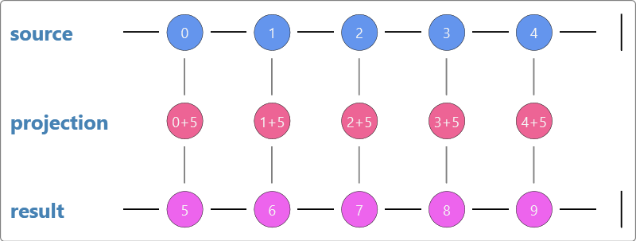
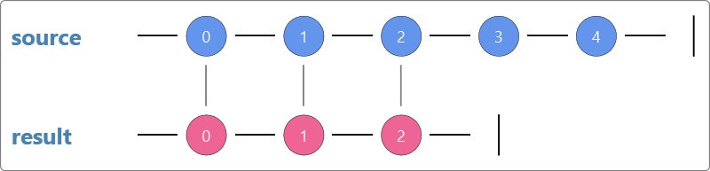
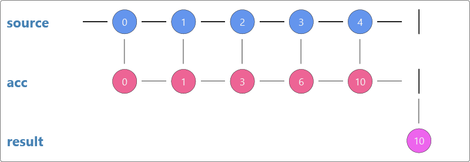
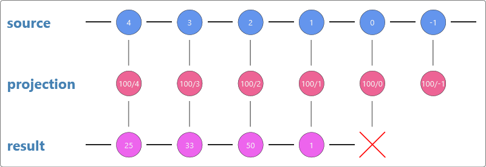
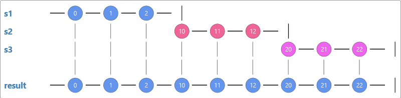
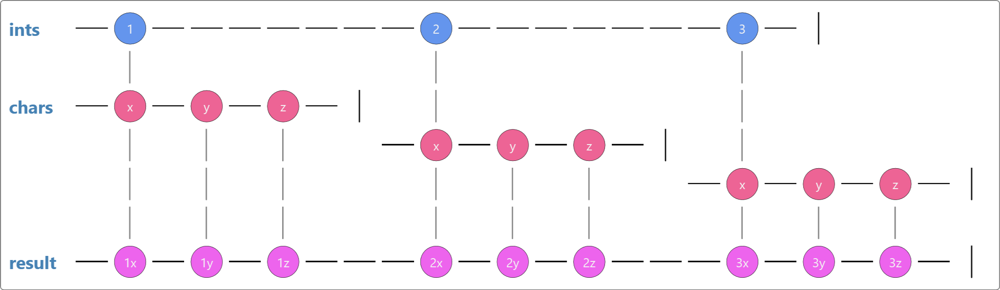

#Introduction to sequences

Taking the data structures we know and love (think arrays/vectors) and applying a different way of think to them, we can make the transition to learning how to program with observable sequences much easier.

For many, coding with reactive sequences will be an existing skill. 
These exercise will still be useful for these people as a type of code kata.
Just like in sport where it is common to warm up, let us ease into our Rx training by doing some simple 101-style coding exercises.

##Imperative for loops

###Projections
To warm up, we will look at looping over an existing sequence of values.
In our first challenge we want to take an existing sequence and translate each of the values of that sequence to produce a new sequence with all of the translated values.

	//Take the sequence [0,1,2,3,4]
	// and create the sequence [5,6,7,8,9]
	var source = new[5]{0,1,2,3,4};
	var output = new[source.length];
	for (int i = 0; i < source.Length; i++)
	{
		output[i] = source[i] + 5;
	}

In the example above (completed for you), a new array is made and the projected values (value+5) is placed into the new array.
In this case, the two arrays are of the same type (integers).

Next take the same values and return an array of char values [A,B,C,D,E,F,G,H,I,J]
	
	//Take the sequence [0,1,2,3,4]
	// and create the sequence [A,B,C,D,E]
	var output = new char[source.Length];
	for (int i = 0; i < source.Length; i++)
	{
		output[i] = default(char); //TODO: Correct this line
	}

##Filters
Next, we will look at filtering values.
Take the integer array and return a new array with only the even integers.

	//Take the sequence [0,1,2,3,4]
	// and create the sequence [0,2,4]
	
	for (int i = 0; i < source.Length; i++)
	{
		
	}
	

Next take the same input, but only return the first 3 values [0,1,2];

	//Take the sequence [0,1,2,3,4]
	// and create the sequence [0,1,2]
	var output = new int[3];
	//TODO: Implement logic to get the first 3 values into 'output'
	return default(int[]);

###Aggregations
Nearly at the end of our warm up now. 
Here we want to calculate the sum of the set of integers.

	//Take the sequence [0,1,2,3,4]
	// and return the value 10
	
	for (int i = 0; i < source.Length; i++)
	{
		
	}

Well that was pretty easy. 
For our last step in the warm up, translate the set of integers to a running total of integers.

	//Take the sequence [0,1,2,3,4]
	// and return the value [0,1,3,6,10]
	var output = new int[source.Length];
	
	for (int i = 1; i < source.Length; i++)
	{
	
	}
	return output;

##Declarative queries
Instead of imperatively telling the compiler how to create our sequences and how to loop over them, lets try a model where we can declare our intent and leave how it is executed to the implementation.

Going back through our examples above, replace the usages of the eagerly evaluated array with a sequence, and replace the imperative style for loops with queries. For example :

	//Take the sequence [0,1,2,3,4]
	// and create the sequence [5,6,7,8,9]
	var source = Enumerable.Range(0,5);
	var output = source.Select(i=>i+5);

Now complete each of the other code samples (projections, filters & aggregates).

##Visualizing sequences
The work we have just done is all quite easy to code and easy to understand.
So while we are all on the same page, let us review the visualizations of each of the samples. These visualizations are called Marble diagrams. 

For the simple work we have done so far probably does not require the expressiveness of a marble diagram, however it helps to start slowly hence why they are introduced this early. 

The basic principal of the Marble diagrams we will use in this training is that a sequence can be represented by a series of values. Values are produces from left to right, so in the above examples value '0' is produced first from the source and then value '1' through to '4'. This can also be represented as an array `[]{0,1,2,3,4}` in many languages.

Currently all the sequences we have looked at are finite and therefore have a trailing pipe (|) to represent the termination of the sequence. For eagerly evaluated sequences like an array, this is really the only possible option; zero or more values and a termination. 

Marble diagrams are useful for showing sequence transformations. 
In the diagrams above, projections were shown as an operator below each value of the source. 
The result of the projection was shown as a value below the projection in the result sequence.

Note the _fall through pipes_ that connect the source value to the projection and then to the final result.

We can also use the absence of these pipes represent a filtering action.
Note below that the odd numbers do not have a fall through pipe, so do not appear in the result sequence.

Other types of sequences however may have difference behaviour. Some sequences can be lazily evaluated. Lazy evaluation brings interesting features like infinite sequences and potentially sequences that can error when generating or reading from them.

###Infinite Sequences
On initial glance, infinite sequences may seem a fictional or purely academic concept; surely an infinite sequence means an infinite loop which means - run away process?!

Well to put your minds at ease, first we will just consider the set of natural numbers (positive integers to be specific). This set/sequence starts at 1 and the next value in the sequence has 1 added to it yielding the next value 2.

We can construct this sequence in code.

	public IEnumerable<int> AllPositiveIntegers()
	{
		var i = 1;
		while(true)
		{
			yield return i++;
		}
	}

You can see the infinite loop due to the `while(true)`, however as this is lazily evaluated, we can choose to consume as much of this sequence as we wish. To avoid running this forever we can choose to just take the first 5 values of the sequence. Here we can visualize the infinite nature of the source sequence with the lack a termination pipe. The consuming sequence however will terminate after the 5th value with a termination pipe.

As Infinite sequences will be useful to us, lets create a flexible generator of infinite sequences. The `Generate` method should take a seed value and some method to create the next value. 

	public IEnumerable<T> Generate<T>(T seed, Func<T, T> increment)
	{
		//TODO
	}

###Sequences that error
If a sequence can be evaluated lazily, that opens scope for errors. In this sample we show a series of fractions: `[100/4, 100/3, 100/2, 100/1, 100/0, 100/-1..]`. If the consumer was to attempt to consume the 5th value, when it was evaluated it would throw a `DivideByZeroException`.

To visualize the error condition, we use an 'x'. Once a sequence has erred, it can not continue. Thus, an error is another form of termination.

To summarise, sequences can produce zero or more values, and, optionally terminate with either a completion or an error.

##Combining sequences
So far we have looked at working with a single sequence, next we will look at ways to combine sequences. 
The ways in which a sequence can be combined with another are varied, so we will focus on a few basic ones to start with.

###Concatenating sequences
To concatenate two sequences is to simply create a sequence which has all the values from the first sequence followed by all the values in the second sequence.

	//Concatenate the two sequences [0,1,2] and [7,8]
	// to create the sequence [0,1,2,7,8]
	

Now you have a concatenated sequence, it too can be used as a source for further concatenation.

	//Concatenate the three sequences [0,1,2] and [10,11,12] and [20,21,22]
	// to create the sequence [0,1,2,10,11,12,20,21,22]

As the sequences are lazily evaluated, sometimes we can not be sure how long these sequences are. If we were to only take the first 5 values of the above sequence, then value `12` from the second sequence would not be evaluated. Further more, the entire 3rd sequence would not be evaluated either. 

###Zipping sequences
Another type of combining sequences, is to take two sequences and pair each value by index for the result sequence.

For example taking the sequence [0,1,2,3,4] and [A,B,C,D,E], you could zip them to create [0A,1B,2C,3D,4E]

	//pair the values by index from the sequences [0,1,2,3,4] and [A,B,C,D,E]
	// to create the sequence [0A,1B,2C,3D,4E]

###Cartesian product
The Cartesian product of two sets in category theory is a result set that is the combination of all values from one set with all values in another set. 
For the two sets [1,2,3] and [x,y,z] the Cartesian product would be the set [1x,1y,1z,2x,2y,2z,3x,3y,3z].
In SQL this is called a _Cross Join_.

Which can also be shown as the following marble diagram

There a several ways to reproduce the desired result of a Cartesian product. 
The imperative way would be to use nested for loops.
Using a declarative query style, the standard type of operator to perform this type of join is the `flatMap` operator.
In .NET this is called `SelectMany`.
Potentially a more accurate name would be `FromOneSelectMany`, but that seems overly verbose.

C# (and VB.NET) offers language support for these types of queries, not just through extension methods, but also through _Query Comprehension Syntax_ (or just _Query Syntax_).
Next try to create the Cartesian product of the two sequences [1,2,3] and[x,y,z] using both extension methods and also Query Syntax.

###Joins
Blindly joining every value from one set/sequence to another as per a _Cross Join_, is not often the desired result.
It is very common to match values from one sequence to specific values of another sequence. 
This is extremely common in Relational Database technologies.

Consider the following two sets of data that map a number to the word for that number in either English or Spanish:

	[(0,"zero"), (1,"one"), (2,"two"), (3,"three")]
	[(1,"uno"), (2,"dos"), (3,"tres"), (4,"cuatro")]

We could join on the common value (the number) to get a map of English to Spanish translations.
Note that the English set has a value for `0`, but not value for `4`. 
The Spanish set however has omitted the value for `0`, but does have a value for `4`.

To join the two sets we could get the new set of

	[("one","uno"),("two","dos"),("three","tres")]

Create the Join of the two sequences using both extension methods and also Query Syntax.

##Eager and lazily evaluated sequences
When discovering infinite sequences, the concept of lazy evaluation was brought up. 
Now we are going to consider what effect this may have on the join clauses we have just looked at.

In two of the above examples, the second sequence was iterated over multiple times.
Now we will consider the impact this may have if one of the sequences was a slow producer of values.

	from x in fastSequence
	from y in slowSequence
	select new {fast=x, slow=y}

compare this to 

	from x in slowSequence
	from y in fastSequence
	select new {fast=y, slow=x}

Two things should be noticeable when contrasting the execution of these two queries:

1. The second query should be faster.
2. The second query will return the same values, but in a different order.

If the order of the query is important, you may find that it is quicker to execute the second query and then sort the result sequence.

	from x in slowSequence
	from y in fastSequence
	orderby y
	select new {fast=y, slow=x}

When considering the performance of your queries, do take into account how they will be executed, and if any lazily evaluated sequences will be executed multiple times.